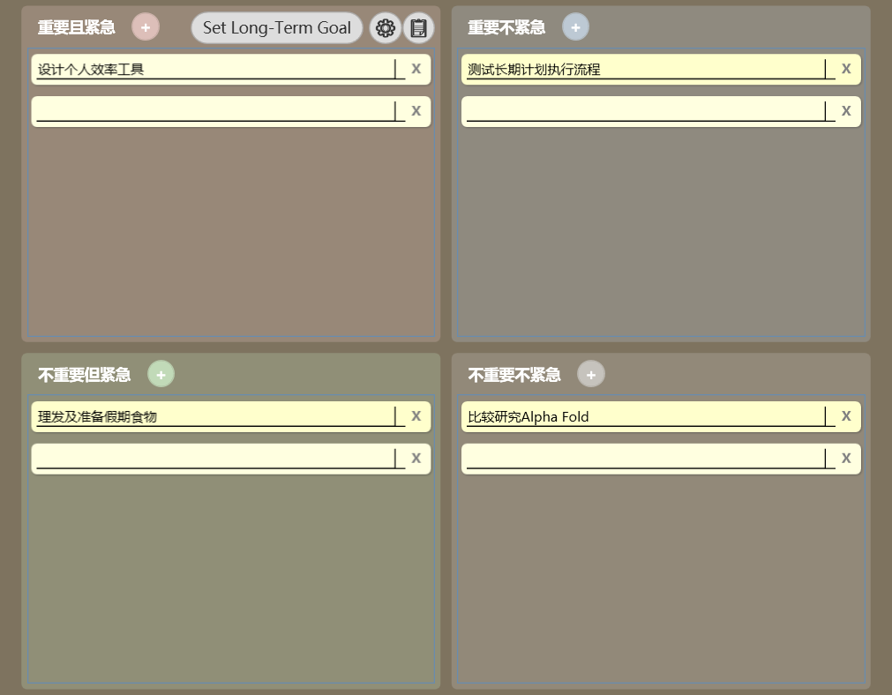
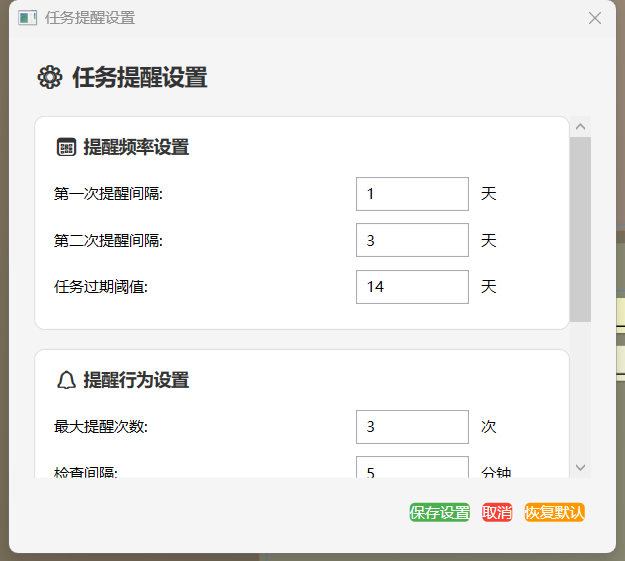
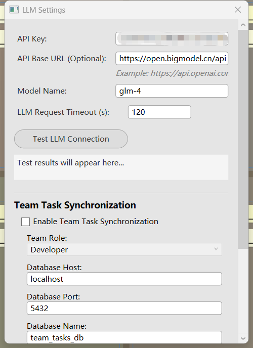
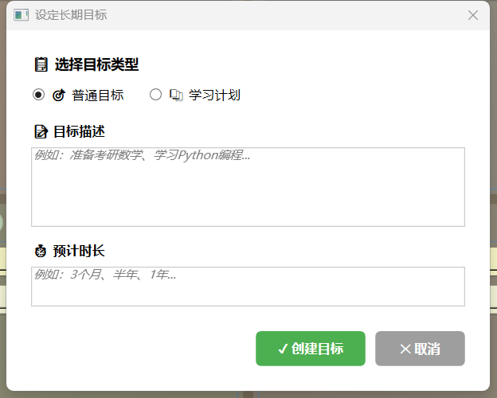
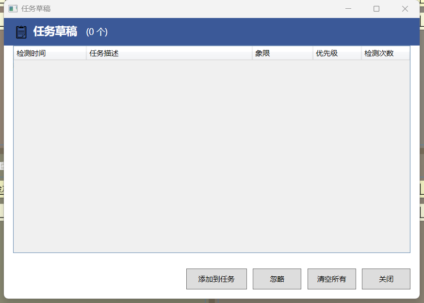

# QuestOS / 命途OS

A Windows desktop life-progress system — evolving into a **Personal Action OS** — built around the Eisenhower Matrix, long-term quests, reminders, voice capture, and AI-guided execution. It does not just store tasks; it turns your real-world conversations and meetings into the next actions.

[](https://github.com/showkeyjar/TimeTask/releases/latest)
[](https://github.com/showkeyjar/TimeTask/blob/HEAD/LICENSE)
[](https://github.com/showkeyjar/TimeTask)

English | [简体中文](README.zh-CN.md)

## Project Status
- Roadmap: [docs/ROADMAP.md](docs/ROADMAP.md)
- Changelog: [CHANGELOG.md](CHANGELOG.md)
- Contributing: [CONTRIBUTING.md](CONTRIBUTING.md)
- Security: [SECURITY.md](SECURITY.md)
- Code of Conduct: [CODE_OF_CONDUCT.md](CODE_OF_CONDUCT.md)

## Download In 30 Seconds
1. Go to [Latest Release](https://github.com/showkeyjar/TimeTask/releases/latest).
2. Download `TimeTask-win-x64.zip`.
3. Unzip and run `TimeTask.exe`.

If this project is useful, please star it to help more users find it.

## Why TimeTask
- Focus by priority: manage tasks in 4 quadrants.
- Close the loop: reminders + overdue nudges + review.
- Connect goals to execution: long-term goals and learning plans.
- Capture quickly: voice to task draft.
- Optional AI support: decomposition and suggestions.

## Main Features
- Four-quadrant task management and quick add.
- Reminder scheduling and overdue alerts.
- Task decomposition and action suggestions (optional LLM).
- Long-term goals and learning plan management.
- Voice recognition to task drafts.
- **Conversation → Action Inbox**: record a meeting or chat (microphone **and** system audio via WASAPI Loopback), let local ASR transcribe it, auto-extract action items, and accept them into the four quadrants with one click.
- Data import/export (JSON).
- Skill management (enable/disable, import/export).

## Screenshots
| Main | Reminder | LLM Settings |
| --- | --- | --- |
|  |  |  |

| Goals | Drafts | |
| --- | --- | --- |
|  |  | |

## Conversation → Action Inbox

TimeTask treats a meeting assistant not as a separate app, but as one **input sensor** feeding the task system. The flow is:

```
现实交流 / 会议 / 电话
        │
   Audio Engine（常驻待命，按需记录）
     ├─ MicrophoneSource  ── WASAPI Capture  ──┐
     └─ SystemLoopbackSource ── WASAPI Loopback ┘
        │  （两路分别流式写盘：mic.wav / system.wav）
        │  （实时转写时再混音喂 ASR；ASR 崩了录音照常）
        ↓
   本地 ASR（Vosk，独立于录音层）
        │
   信息分类：Task / Reminder / Decision / Note
        │
   TimeTask · 四象限 / 目标 / 提醒
        │
   行动收件箱（Action Inbox）· 一键「全部接受」
```

### Why this design (V2 audio layer)

- **Two sources, two tracks.** Meeting/Conversation mode opens both the microphone and the system playback audio (WASAPI Loopback). They are written to **separate** `mic.wav` / `system.wav` files so future "me / them" separation and speaker diarization stay easy. The live transcript is produced from a mixed stream.
- **Streaming write, never all-in-memory.** Recording starts the instant you click "开始"; audio is written to disk chunk-by-chunk and only finalized on stop. A 2-hour meeting is never held in a `List<byte>`.
- **No dropped first word (pre-roll).** Capture + ASR feeding begin on the first frame. If the Vosk model finishes loading a moment later, the buffered audio is back-filled into the recognizer, so the opening of the meeting is never lost.
- **ASR is decoupled from recording.** If Vosk is unavailable, recording and disk write continue normally; you simply get no live transcript this time (the audio is still saved for later transcription).
- **Adaptive silence, not a fixed -30 dB.** Quick-dictation auto-stop uses a dynamically estimated noise floor instead of a hard threshold, so it works across laptops, headsets, and offices.
- **Two clearly separate entries.** Quick-dictation (mic only, auto-ends on silence, feeds task drafts) is distinct from Meeting/Conversation recording (mic + system, can run for hours).

How to use:

1. TimeTask starts in **standby** (system tray resident). It does **not** record 24×7 by default.
2. Right-click the tray icon → **🎙 快捷口述** / **⏺ 开始交流记录** / **🖥 开始会议记录**. While recording, the tray tooltip shows `● 录音中 mm:ss · 麦克风✓ · 系统✓`.
3. Speak / hold a meeting (Tencent Meeting, Teams, Zoom…). Both your voice and the other party's audio (played through speakers/headset) are captured and written to disk.
4. Click **■ 停止记录** (or it auto-stops after the configured timeout). TimeTask transcribes locally and extracts action items.
5. The **Action Inbox** window shows a summary, the transcript, and each detected action with a suggested quadrant + reminder. Click **全部接受** and the tasks land in the four quadrants.

Key settings in `App.config`:

| Key | Default | Meaning |
| --- | --- | --- |
| `VoiceAutoStartOnLaunch` | `false` | If `true`, also auto-start the always-on quick-dictate listener on launch. |
| `ConversationCaptureIncludeSystemAudio` | `true` | Capture system playback audio (WASAPI Loopback) so remote meeting voices are recorded as a separate `system.wav`. |
| `ConversationCaptureAutoStopMinutes` | `120` | Auto-stop a meeting/conversation capture after this long. |
| `ConversationCaptureQuickSilenceSeconds` | `8` | Quick-dictate auto-stops after this much silence (adaptive threshold). |
| `ConversationCaptureQuickMaxWaitSeconds` | `60` | Quick-dictate also stops if no speech is detected within this long. |

> Design boundary: TimeTask is **standby-by-default, not always-recording**. Full-text search, speaker diarization, auto-meeting-detection and long-term memory are intentionally deferred.

## Build From Source
- Environment: Windows + Visual Studio + .NET Framework 4.7.2 (WPF).
- Open `TimeTask.sln`.
- Build and run.

## Optional Configuration
- LLM settings in `App.config` (`OpenAIApiKey`, `LlmProvider`, `LlmApiBaseUrl`, `LlmModelName`).
- Voice/FunASR can use local runtime bundle: `data/funasr-runtime-bundle.zip`.
- Auto update can check GitHub Releases on startup.

## Contributing
- Bug reports and ideas: [Issues](https://github.com/showkeyjar/TimeTask/issues)
- Feature discussions: [Discussions](https://github.com/showkeyjar/TimeTask/discussions)
- Contribution guide: [CONTRIBUTING.md](CONTRIBUTING.md)

## License
MIT - see [LICENSE](LICENSE).

