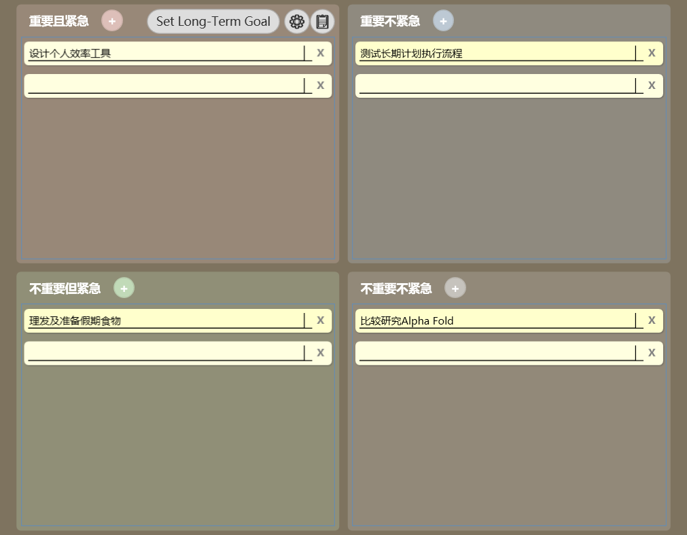
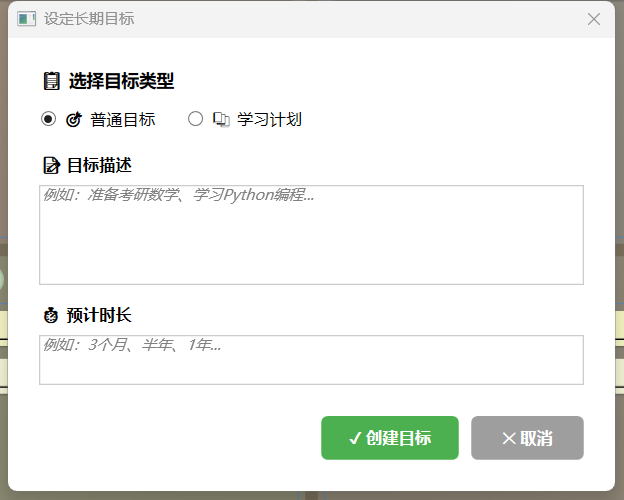
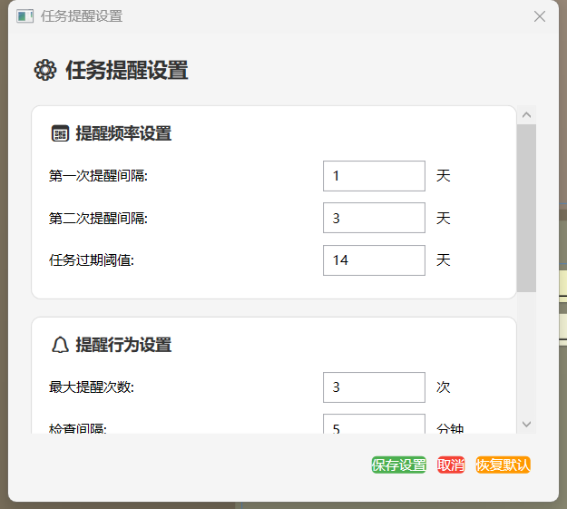
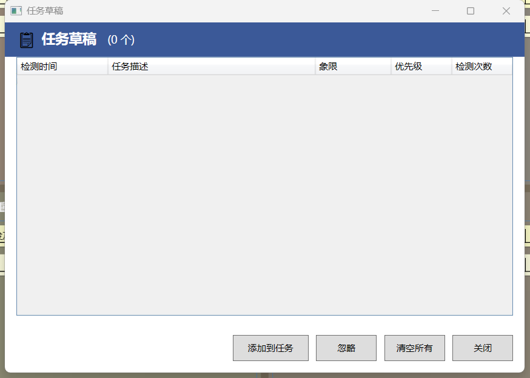

# 任务管理助手

本程序使用C#开发，用于常驻桌面，将用户的工作待办事项分为重要紧急四象限管理

用于时刻提醒用户聚焦于重要且紧急的工作，减少工作中的干扰

## 使用方法

1.下载源码：git clone https://github.com/showkeyjar/TimeTask.git

2.编译运行：使用 Visual Studio 打开项目，编译并运行

3.双击 autorun.reg 文件，将程序添加到开机自启动列表

4.双击 TimeTask.exe 运行程序

## 功能

1. 任务分类

   任务分为重要紧急四象限

   重要紧急、重要不紧急、不重要紧急、不重要不紧急

   todo 需要加入LLMProvider，根据用户的描述，自动分类任务，也可通过用户历史任务分析和推测，给出更准确的分类结果

2.  **定时提醒任务**
    用户可以在添加新任务时设置一个具体的提醒时间。
    - 在“Add New Task”窗口中，勾选“Set Reminder”复选框。
    - 使用日期选择器（Reminder Date）和时间选择器（Reminder Time: 小时和分钟下拉框）来设定提醒的具体日期和时间。
    - 设置后，任务旁边会显示一个“⏰”图标，表示该任务有待处理的提醒。
    - 当到达设定的提醒时间，程序会弹出一个消息框提醒用户。
    - 提醒触发后，该任务的特定时间提醒将被清除（“⏰”图标消失），以避免重复通知。

3.  **象限快捷添加任务**
    每个象限标题的右侧新增了一个“+”图标按钮。
    - 点击对应象限的“+”按钮，可以快速打开“Add New Task”窗口。
    - 新任务的所属分类（如“重要且紧急”）将根据点击的“+”按钮所在象限自动预先选定。

4. 任务提醒

   todo 任务提醒功能，提醒用户任务的重要性，可结合LLMProvider，根据用户的描述，自动提醒用户任务的重要性
   长期没有进度的任务，也可以帮助用户智能分析原因并做出改进（比如分解为子目标、改变目标或放弃等等）

5. 任务完成

   todo 任务完成功能，记录用户完成任务的时间

6. 任务统计

   todo 任务统计功能，统计用户完成任务的时间

7. 任务管理

   任务管理功能，管理用户的任务

8.  **智能人声录音（后台监听）**

    - 程序启动后自动在后台监听麦克风。
    - 当检测到有人声且语音识别成“有意义的句子”（置信度达到阈值）时，自动开始录音。
    - 若连续超过 30 秒未检测到讲话，则自动停止并保存音频文件。
    - 录音格式：WAV（16kHz/16bit/Mono），保存目录：`Recordings/`（程序根目录）。
    - 适用场景：日常工作记录、会议纪要留痕，便于后续整理与任务分解。

    使用说明：
    - 默认自动开启，无需手动操作。
    - 如需临时关闭，可在系统托盘或应用设置中加入开关（后续版本提供 UI）；当前可通过退出程序停止监听。
    - 首次运行如提示缺少语音识别引擎或无可用麦克风，请确认 Windows 已安装语音识别组件并正确连接麦克风。

## 界面截图

为避免单张图片过大导致阅读疲劳，以下截图采用小尺寸分组展示：

### 主流程界面




### 配置与高级功能





## LLM Provider Configuration

This application uses Large Language Models (LLMs) to provide features like automatic task classification, smart reminders, and task decomposition. The primary supported provider is Zhipu AI, but the configuration is flexible. To enable these features, you need to configure your API key and other relevant settings.

1.  **Obtain an API key:** Obtain an API key from your chosen LLM provider (e.g., Zhipu AI).
2.  **Locate `App.config`:** Find the `App.config` file in the application's directory (usually where the `.exe` file is located).
3.  **Edit `App.config`:** Open the `App.config` file in a text editor. Look for the `<appSettings>` section. You will need to configure the following keys:
    *   `OpenAIApiKey`: Your API key for the LLM provider.
    *   `LlmProvider`: Specifies the provider (e.g., "zhipu").
    *   `LlmApiBaseUrl`: The base URL for the provider's API.
    *   `LlmModelName`: The specific model you wish to use.

    Here is an example configuration for Zhipu AI:
    ```xml
    <appSettings>
        <add key="OpenAIApiKey" value="YOUR_ZHIPU_API_KEY" />
        <add key="LlmProvider" value="zhipu" />
        <add key="LlmApiBaseUrl" value="https://open.bigmodel.cn/api/paas/v4/" />
        <add key="LlmModelName" value="glm-4" />
    </appSettings>
    ```
4.  **Replace Placeholder:** Replace `YOUR_ZHIPU_API_KEY` with your actual API key. Adjust `LlmApiBaseUrl` and `LlmModelName` if you are using a different provider or model.
5.  **Save and Restart:** Save the `App.config` file. The LLM features should be active the next time you run the application.

**Note:** If the API key or other LLM configurations are incorrect or missing, the LLM-powered features will not work as expected. You might see dummy responses (potentially indicating a configuration error), or errors logged in the application's console output.

## LLM 功能触发说明
当前版本中，以下功能会触发与大语言模型 (LLM) 的交互：
*   创建新任务时，对任务描述进行清晰度分析，并在必要时引导用户优化描述。
*   创建新任务时，根据任务描述智能推荐任务所属的分类列表。
*   程序启动时，为超过两周未更新的活动任务生成提醒信息和行动建议。
*   当旧任务的提醒中包含分解建议，并且用户同意后，尝试将任务分解为子任务。

## 语音模型自动下载与提炼优化
当前版本已支持语音模型自动准备：
* 启动时会自动检查 `%AppData%/TimeTask/speech-models/<SpeechModelName>/`。
* 若本地不存在模型且 `SpeechModelAutoDownload=true`，会从 `SpeechModelUrl` 下载 zip 并自动解压。
* 可选配置 `SpeechModelSha256` 做完整性校验。
* 若模型目录下存在 `phrases.txt`，会自动加载为识别提示词，提高任务类语句识别准确率。
* 默认不会将 `phrases.txt` 作为 Vosk 强约束词表，避免对自然口语造成漏识别；可通过 `VoiceUseStrictVoskGrammar=true` 开启严格模式。
* 运行日志输出到 `%AppData%/TimeTask/logs/voice-runtime.log`，可用于排查下载和识别初始化问题。
* 语音草稿可自动加入四象限（默认开启），由 `VoiceAutoAddToQuadrant` 控制。
* 语音草稿可使用 LLM 重新计算象限（默认开启），由 `VoiceUseLlmQuadrant` 控制。
* 语音草稿默认需要用户确认后才进入四象限，由 `VoiceRequireConfirmation` 控制。
* 可从对话内容中自动抽取代办事项草稿，由 `VoiceConversationExtractEnabled` 控制。
* 用户确认的草稿会加入个人词库，用于提升后续识别准确率。
* 支持声纹识别（简单声纹），用于确认是否为用户本人发声。
* 草稿支持多选和一键添加全部，并减少频繁通知。

FunASR 本地子进程模式：
* `VoiceAsrProvider=funasr` 时，程序会在每段语音结束后调用本地 Python 脚本 `scripts/funasr_asr.py` 进行识别。
* 推荐使用“预置运行时包”模式：将可用 Python 环境打包为 `funasr-runtime-bundle.zip`，程序启动时自动解压并直接使用。
* 推荐最小流程（开发机一次性操作）：
  * `powershell -ExecutionPolicy Bypass -File scripts/build_funasr_runtime_bundle.ps1 -PythonExe "<你的 py311 路径>"`
  * 将生成的 `funasr-runtime-bundle.zip` 放到程序目录（如 `bin\Release`）。
* 默认启用 `FunAsrUsePersistentWorker=true`：使用常驻子进程复用已加载模型，避免每段语音都重复加载模型导致超时。
* 当 `FunAsrPreferPrebuiltRuntime=true` 且 `FunAsrAllowOnlineInstallFallback=false` 时，未找到预置包将直接提示不可用（不会进入复杂在线安装流程）。
* 一般无需用户手动执行 `pip install`；仅在网络受限或被安全策略拦截时，才需要手动处理。
* 若运行中检测到 `No module named 'funasr'`，会自动触发一次运行时修复并重试识别。
* 可通过 `FunAsrModel`、`FunAsrDevice`、`FunAsrTimeoutSeconds` 调整模型、设备和超时策略。

`App.config` 示例：
```xml
<add key="SpeechModelAutoDownload" value="true" />
<add key="SpeechModelName" value="vosk-model-cn-0.22" />
<add key="SpeechModelUrl" value="" />
<add key="VoiceUseStrictVoskGrammar" value="false" />
<add key="VoiceSystemSpeechUseHints" value="false" />
<add key="VoiceAsrProvider" value="funasr" />
<add key="FunAsrPythonExe" value="python" />
<add key="FunAsrScriptPath" value="scripts\funasr_asr.py" />
<add key="FunAsrModel" value="iic/SenseVoiceSmall" />
<add key="FunAsrPreferPrebuiltRuntime" value="true" />
<add key="FunAsrRuntimeBundlePath" value="funasr-runtime-bundle.zip" />
<add key="FunAsrAllowOnlineInstallFallback" value="false" />
<add key="FunAsrDevice" value="cpu" />
<add key="FunAsrAutoBootstrap" value="true" />
<add key="FunAsrBootstrapTimeoutSeconds" value="900" />
<add key="FunAsrMaxPythonMinor" value="12" />
<add key="FunAsrAutoProvisionCondaPython" value="true" />
<add key="FunAsrCondaPythonVersion" value="3.11" />
<add key="FunAsrCondaExe" value="" />
<add key="FunAsrPipPackages" value="funasr modelscope torch torchaudio" />
<add key="FunAsrUsePersistentWorker" value="true" />
<add key="FunAsrWorkerStartupTimeoutSeconds" value="600" />
<add key="FunAsrTimeoutSeconds" value="60" />
<add key="FunAsrMinSegmentSeconds" value="0.5" />
<add key="SpeechModelSha256" value="" />
<add key="VoiceAutoAddToQuadrant" value="true" />
<add key="VoiceAutoAddMinConfidence" value="0.65" />
<add key="VoiceUseLlmQuadrant" value="true" />
<add key="VoiceRequireConfirmation" value="true" />
<add key="VoiceConversationExtractEnabled" value="true" />
<add key="VoiceConversationWindowSeconds" value="45" />
<add key="VoiceConversationMinTurns" value="3" />
<add key="VoiceSpeakerVerifyEnabled" value="true" />
<add key="VoiceSpeakerEnrollMode" value="true" />
<add key="VoiceSpeakerThreshold" value="0.72" />
<add key="VoiceSpeakerMinSeconds" value="2.0" />
<add key="ProactiveAssistEnabled" value="true" />
<add key="BehaviorLearningEnabled" value="true" />
<add key="StuckNudgesEnabled" value="true" />
<add key="LlmSkillAssistEnabled" value="true" />
<add key="QuietHoursStart" value="22" />
<add key="QuietHoursEnd" value="8" />
```

说明：
* 当 `SpeechModelUrl` 留空且 `SpeechModelName=vosk-model-cn-0.22` 时，程序会使用内置默认地址自动下载更大中文模型（更准确，体积更大）。
* 当前识别链路可配置：`VoiceAsrProvider=funasr`（本地 Python 子进程）或 `VoiceAsrProvider=hybrid`（Vosk/System.Speech + FunASR）。
* 当回退到 `System.Speech` 时，默认不加载 hints grammar（`VoiceSystemSpeechUseHints=false`），以降低部分中文引擎异常概率。
* 日志中出现 `Vosk recognizer initialized`、`Recognized(vosk)` 表示模型已真实参与语音转写。
* 日志中出现 `Recognized(funasr)` 表示 FunASR 子进程结果已进入任务提炼链路。
* FunASR 自动安装日志会写入 `%AppData%/TimeTask/logs/voice-runtime.log`（关键字：`FunASR bootstrap`）。
* 可通过脚本 `scripts/build_funasr_runtime_bundle.ps1` 在开发机生成预置运行包，再随程序分发。
* 若当前系统 Python 为 3.13+，程序会自动判定为不兼容并回退本地引擎（可通过安装 3.10/3.11/3.12 并配置 `FunAsrPythonExe` 切回 FunASR）。
* 新版本可在检测到 Python 不兼容时自动尝试通过 Conda 创建 Python 3.11 运行时（默认开启）。
* 主界面“右上象限（重要不紧急）标题栏”提供“耳朵状态图标”：
  * 同时显示文字状态（`语音·加载中/安装中/可监听/识别中/不可用`）
  * 橙色并脉冲：模型安装/加载中
  * 灰色：语音不可用
  * 绿色：可监听
  * 蓝色并脉冲：正在识别
* `phrases.txt` 会用于提升 Vosk 识别准确率（语音热词/短语列表）。
* 主动协同能力（提醒、卡点建议）可通过 `ProactiveAssistEnabled` 总开关控制。
* 若只想保留提醒但不做用户画像学习，可将 `BehaviorLearningEnabled=false`。
* 可通过 `LlmSkillAssistEnabled` 启用/停用“LLM Skill 推荐”（分解、冲刺、优先级重排、风险检查等）。
* 可通过 `QuietHoursStart/QuietHoursEnd` 配置安静时段（例如 22 到 8）。

## 注意事项

1.读写csv

https://stackoverflow.com/questions/46062883/c-sharp-wpf-read-edit-csv

2.开机自启动

编辑 autorun.reg 里的程序路径，双击运行
